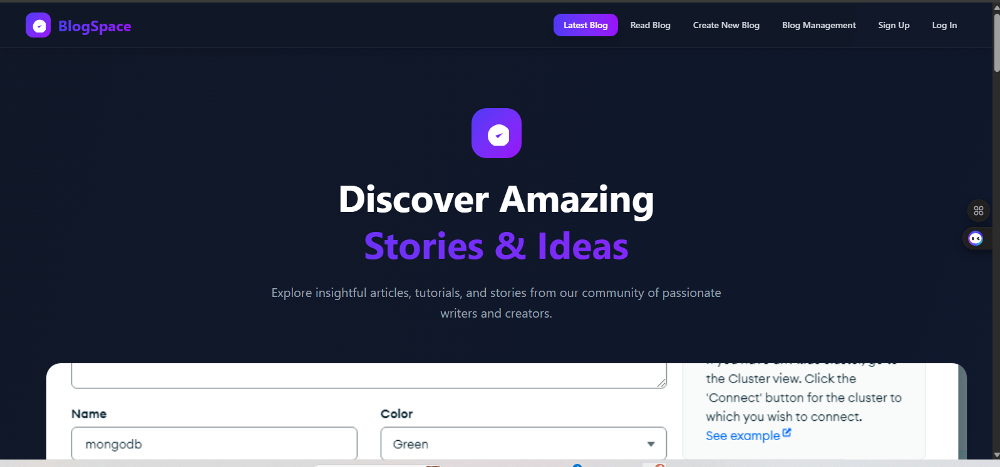

[](https://classroom.github.com/online_ide?assignment_repo_id=19922269&assignment_repo_type=AssignmentRepo)
# MERN Blog Application

A full-stack blog platform built with MongoDB, Express.js, React.js, and Node.js. Users can register, log in, create posts with featured images, comment, and browse posts by category.

## Features

- User registration and login (JWT authentication)
- Create, edit, delete blog posts
- Upload featured images for posts
- Comment on posts
- Category management
- Responsive UI with React and Tailwind CSS
- RESTful API with Express and Mongoose

## Project Structure

```
client/           # React front-end
  blog/
    src/
      components/
      pages/
      services/
      hooks/
      context/
    public/
    package.json

server/           # Express.js back-end
  controllers/
  models/
  routes/
  middleware/
  uploads/        # Uploaded images
  config/
  server.js
  package.json
```

## Getting Started

### Prerequisites

- Node.js (v18+)
- MongoDB (local or Atlas)
- npm or pnpm

### Setup

1. Clone the repository
2. Install dependencies in both `client/blog` and `server` folders:
   ```sh
   cd server
   npm install
   cd ../client/blog
   npm install
   ```
3. Create `.env` files in both `client/blog` and `server` using `.env.example` as reference.
4. Start MongoDB locally or set up Atlas.
5. Start the server:
   ```sh
   cd server
   npm start
   ```
6. Start the client:
   ```sh
   cd client/blog
   npm run dev
   ```

## API Endpoints

### Posts

- `GET /api/posts` - Get all posts
- `GET /api/posts/:id` - Get a single post
- `POST /api/posts` - Create a post (protected, supports image upload)
- `PUT /api/posts/:id` - Update a post (protected)
- `DELETE /api/posts/:id` - Delete a post (protected)

### Categories

- `GET /api/categories` - Get all categories
- `POST /api/categories` - Create a category (protected)

### Users

- `POST /api/register` - Register a new user
- `POST /api/login` - Login

## Image Upload

- Images are uploaded via the `/api/posts` endpoint using `multipart/form-data` with the field name `featuredImage`.
- Uploaded images are served from `/uploads/<filename>`.

## Environment Variables

See `.env.example` in both `client/blog` and `server` for required variables.

## Screenshots



## License
.
MIT

---

For more details, see [Week4-Assignment.md](Week4-Assignment.md).
